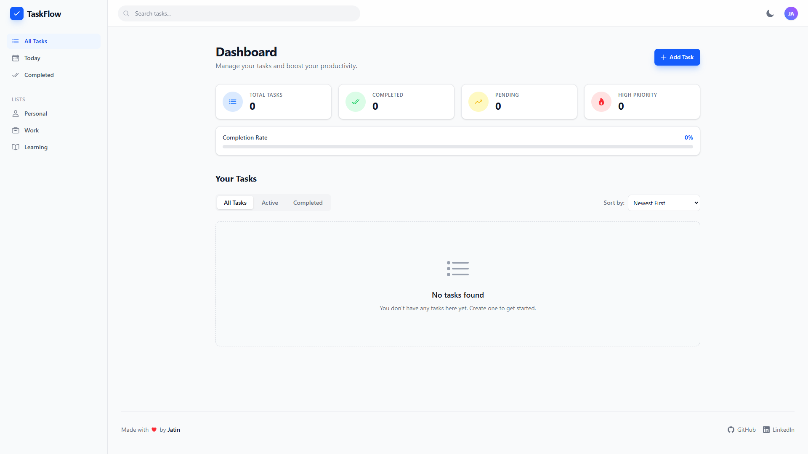
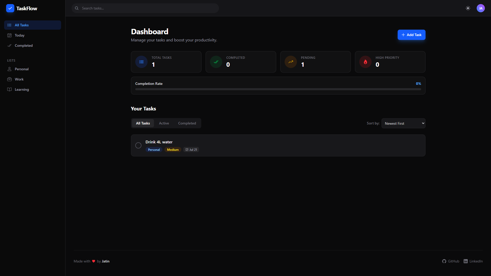
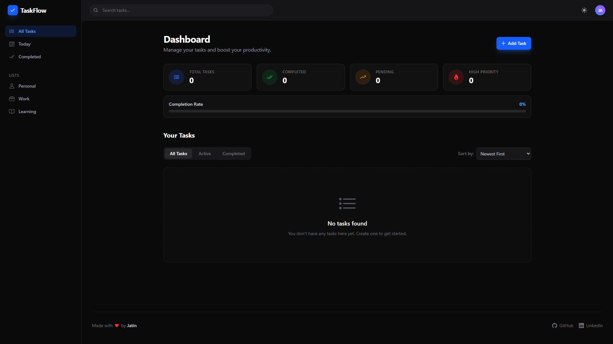
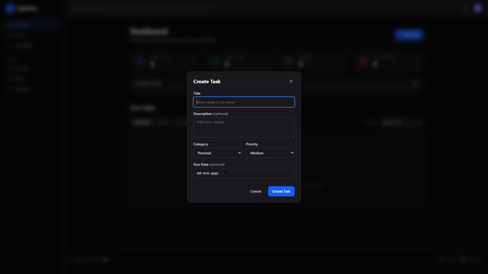

# TaskFlow – Modern Task Management 🚀

TaskFlow is a premium, production-ready productivity and task management application engineered with modern React and Redux Toolkit. Built with a focus on seamless user experience, it transcends standard to-do apps by offering robust state management, real-time dynamic filtering, multi-variate sorting, and a beautiful Linear-inspired glassmorphism design.

This project demonstrates advanced frontend architecture, scalable component structures, and meticulous attention to UI/UX details, making it a perfect showcase of enterprise-grade React development.

---

## ✨ Key Features

- **Advanced Task Management**: Full CRUD operations with detailed metadata including Priorities (High, Medium, Low), Categories (Work, Personal, Learning), and Due Dates.
- **Dynamic Redux Engine**: Leverages `@reduxjs/toolkit` for absolute state predictability, seamlessly persisting complex nested states to `localStorage`.
- **Intelligent Filtering & Sorting**: Instantly filter tasks by status or category, and sort them chronologically, by priority, or by approaching deadlines.
- **Premium UI/UX**: Designed with Tailwind CSS v4, featuring glassmorphic overlays, fluid transitions, hover micro-interactions, and beautiful Empty States.
- **Dark & Light Mode**: A robust, persistent theme switcher that seamlessly toggles the interface via custom Tailwind CSS variants.
- **Global Search**: Instantly find tasks through a lightning-fast, real-time search implementation across the entire dashboard.
- **Instant Feedback**: Integrated with `react-hot-toast` for elegant, non-intrusive popup notifications upon user actions.
- **Fully Responsive**: Flawlessly adapts across all device viewports, snapping from a multi-column dashboard on desktop to a compact, intuitive mobile layout.

---

## 🎨 Project Preview

|                           Dashboard & Overview                            |                              Task Management                               |
| :-----------------------------------------------------------------------: | :------------------------------------------------------------------------: |
|  |  |

|                         Dark Mode Aesthetic                          |                           Add / Edit Modal                            |
| :------------------------------------------------------------------: | :-------------------------------------------------------------------: |
|  |  |

---

## 🚀 Live Demo

[Experience TaskFlow Live](https://taskflowtodos.netlify.app/)

---

## 💻 Tech Stack & Architecture

TaskFlow is built using a modern, scalable technology stack chosen for speed, reliability, and developer experience.

| Technology          | Role             | Description                                                                                     |
| :------------------ | :--------------- | :---------------------------------------------------------------------------------------------- |
| **React 19**        | Core Framework   | Utilizes the latest React hooks and component paradigms for a highly interactive UI.            |
| **Redux Toolkit**   | State Management | Provides a centralized, predictable state container, managing complex filters and CRUD logic.   |
| **Vite**            | Build Tooling    | Delivers lightning-fast HMR and optimized production bundles.                                   |
| **Tailwind CSS v4** | Styling          | Powers the entire design system using utility classes, CSS variables, and responsive modifiers. |
| **React Icons**     | Assets           | Integrates lightweight, scalable vector icons (`Io5`) across the interface.                     |
| **React Hot Toast** | UI Feedback      | Delivers smooth, customizable toast notifications.                                              |

---

## 📁 Scalable Folder Architecture

The codebase is organized using enterprise-standard patterns to ensure maintainability and separation of concerns:

```text
src/
├── components/
│   ├── features/      # Complex logic components (TaskModal, TaskList, DashboardCards)
│   ├── layout/        # Structural components (Navbar, Sidebar, AppLayout)
│   └── ui/            # Reusable primitives (Button, Input, ThemeToggle)
├── redux/
│   ├── slices/        # Redux Toolkit slices (taskSlice.js)
│   └── store.js       # Centralized store configuration
├── utils/             # Helper functions (Tailwind class merging)
├── App.jsx            # Application root and assembly
└── main.jsx           # React DOM rendering
```

---

_Made with 💖 by Jatin Agrahari_
